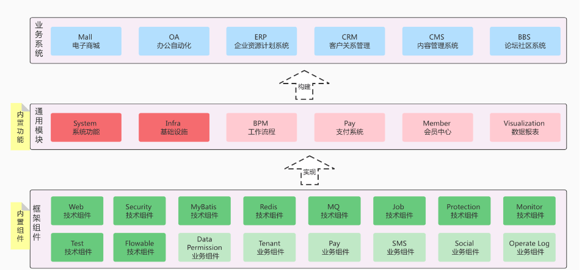
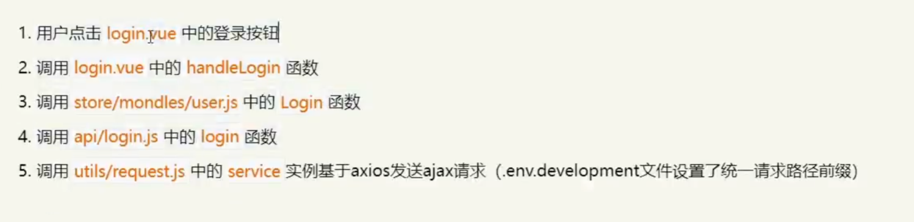
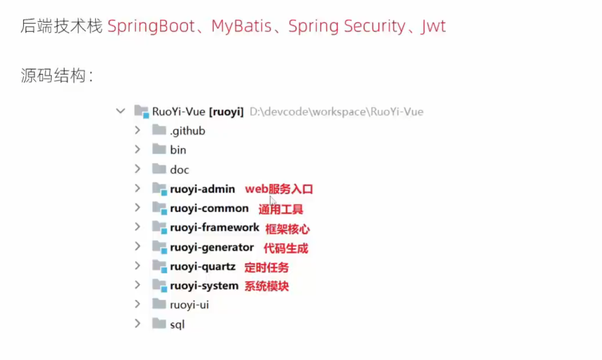
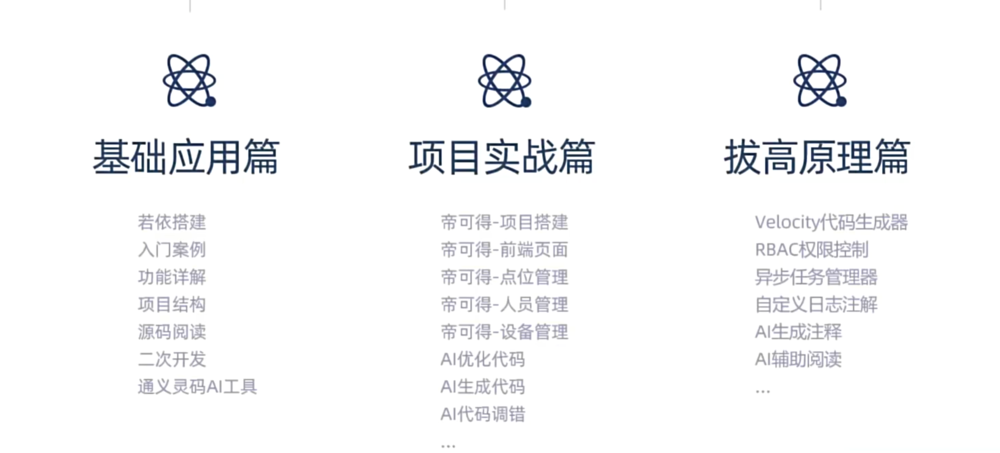

# RuoYi

## 介绍

### 哪些项目可以使用

**项目可以是商城、SCRM 系统、OA 系统、物流系统、ERP 系统、CMS 系统、HIS 系统、支付系统、IM 聊天、微信公众号、微信小程序等等**



### 低代码

* 目的：将可重复性的编程工作通过平台实现
* 将开发人员从没有技术含量的增删改查开发中解放出来
* 让其专注于更有价值的开发工作
* 如：数据库设计、流程设计、API核心开发、业务逻辑开发等工作

## 前端



## 后端



## 图片回显

**ImageUpload.vue**

```java
// 然后将数组转为对象数组
this.fileList = list.map(item => {
  if (typeof item === "string") {
    // 如果是若依内部路径/profile，则拼接上baseUrl
    if (item.indexOf(this.baseUrl) === -1 && item.startsWith("/profile")) {
        item = { name: this.baseUrl + item, url: this.baseUrl + item };
    } else {
      // 如果是外部路径，则直接使用
        item = { name: item, url: item };
    }
  }
```


## 学习安排



## 项目准备

```text
JDK >= 1.8 (推荐1.8版本)
Mysql >= 5.7.0 (推荐5.7版本)
Redis >= 3.0
Maven >= 3.0
Node >= 12
```

## 后端运行

1、创建数据库`ry-vue`并导入数据脚本`ry_2021xxxx.sql`，`quartz.sql`
2、打开项目运行`com.ruoyi.RuoYiApplication.java`，出现如下图表示启动成功。

## 前端运行

```bash
# 进入项目目录
cd ruoyi-ui

# 安装依赖
npm install

# 强烈建议不要用直接使用 cnpm 安装，会有各种诡异的 bug，可以通过重新指定 registry 来解决 npm 安装速度慢的问题。
npm install --registry=https://registry.npmmirror.com

# 本地开发 启动项目
npm run dev
```

